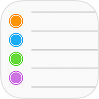
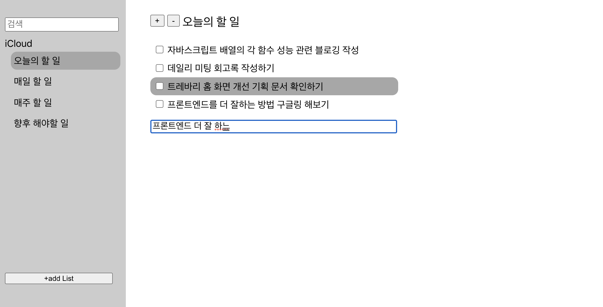
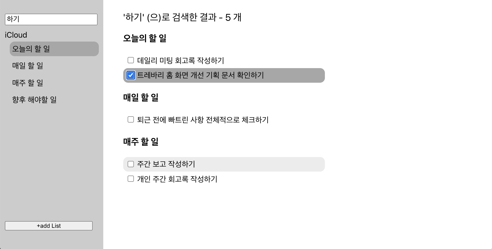
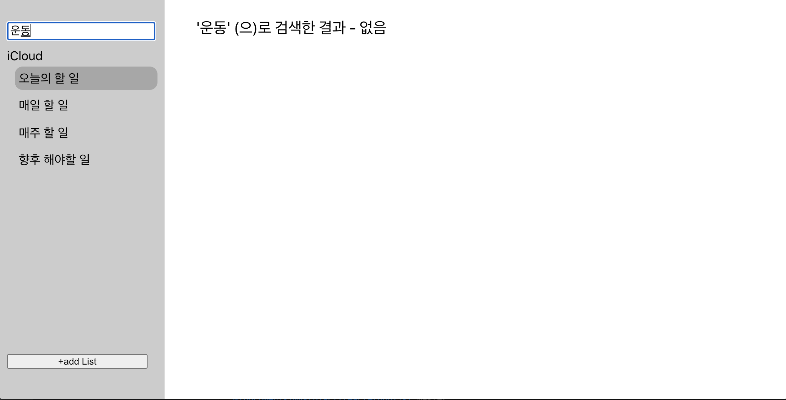

# 미니 프로젝트 : TODO LIST

ios의 `미리알림` 애플리케이션 기능을 유사하게 구현해본 TODO LIST 입니다.

### 투두 리스트 입력 화면

---

### 투두 리스트 검색 화면

---

### 투두 리스트 검색어 없음

---

#### 기능 소개

- 투두 리스트 그룹 생성
- 각 그룹의 투두 리스트 관리
  - 투두 추가, 삭제 및 투두 완료
- 투두 리스트 검색 기능
  - 검색어에 맞는 투두 리스트를 그룹 별 노출

#### 기술 스택

이 프로젝트에 사용된 기술은 다음과 같습니다.

- Language: React.js
- Styling: CSS
- Project Setup: create-react-app

#### 프로젝트 시연

- npm install: 기본 라이브러리 패키지 설치
- npm start: 프로젝트 실행
- 브라우저 주소 창에 http://localhost:3000 접속
